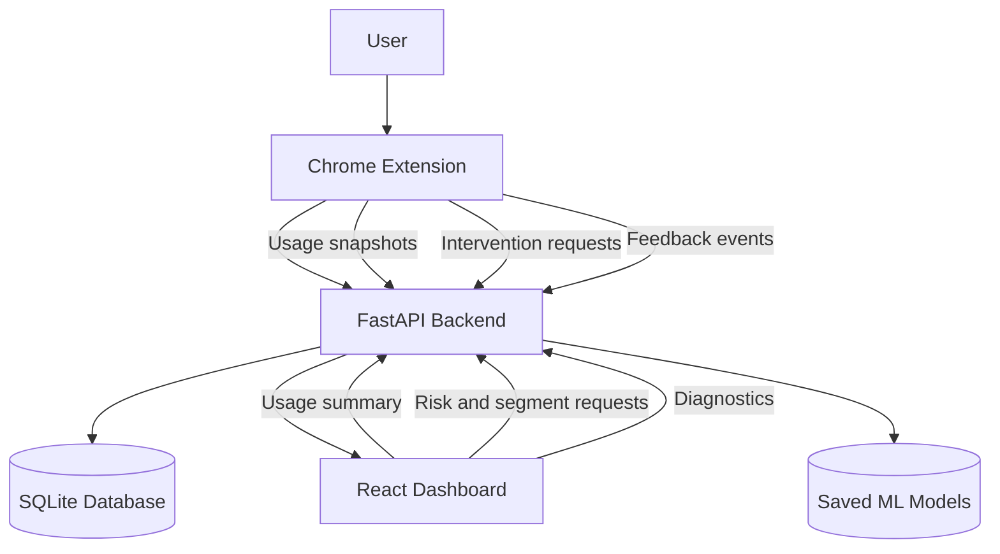
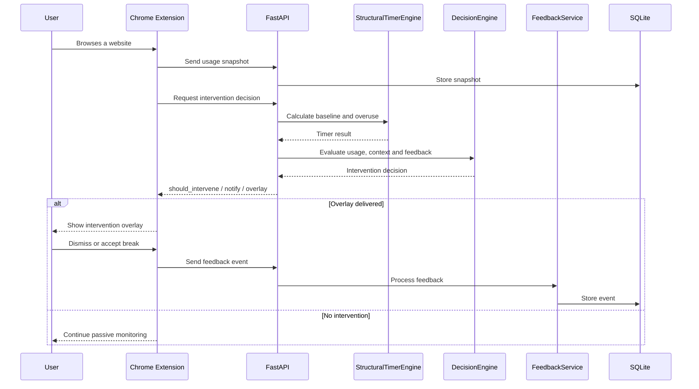
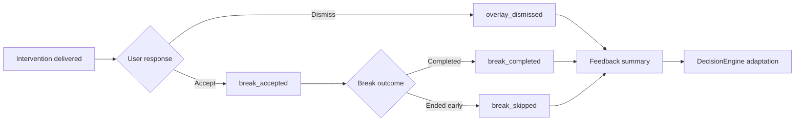

# HabitGuard System Architecture

## 1. Purpose

This document explains the architecture of HabitGuard, a JITAI-inspired digital wellbeing system composed of:

- a Chrome extension,
- a FastAPI backend,
- a SQLite persistence layer,
- a React dashboard,
- a structural timer and decision engine,
- a feedback-adaptation loop,
- supporting machine-learning analytics.

The live intervention loop is controlled by the structural timer and decision engine. Machine-learning models provide supporting dashboard analytics and do not directly control intervention delivery.

---

## 2. High-Level Architecture



---

## 3. Architectural Layers

### 3.1 Client Layer

The client layer contains the Chrome extension and the React dashboard.

#### Chrome Extension

The extension is responsible for:

- tracking active browser sessions,
- identifying the active domain,
- storing local session state,
- assigning domain context,
- synchronising usage snapshots,
- requesting intervention decisions,
- displaying notifications,
- displaying intervention overlays,
- running break countdowns,
- sending feedback events.

Important files include:

```text
chrome_extension/
├── background.js
├── content.js
├── popup.js
├── popup.html
├── popup.css
└── manifest.json
```

#### React Dashboard

The dashboard is responsible for:

- visualising current usage,
- showing the personalised baseline,
- displaying the overuse gap,
- showing domain and session statistics,
- displaying intervention information,
- presenting anomaly and forecast analytics,
- collecting questionnaire values for risk and segmentation,
- showing model diagnostics.

The dashboard is an observation and explanation layer. It does not directly decide whether an intervention should occur.

---

### 3.2 API Layer

The FastAPI application exposes endpoints for:

- usage storage,
- usage summaries,
- intervention decisions,
- feedback collection,
- feedback summaries,
- risk prediction,
- user segmentation,
- diagnostics.

Representative endpoints include:

```http
POST /usage/snapshot
GET  /usage/summary/local_user
POST /habitguard/custom/intervention
POST /feedback/event
GET  /feedback/summary?user_id=local_user
POST /risk/predict
POST /segment/predict
GET  /diagnostics
```

The interactive API documentation is available locally at:

```text
http://127.0.0.1:8000/docs
```

---

### 3.3 Service Layer

The service layer contains the main project logic.

#### StructuralTimerEngine

The structural timer:

- checks whether enough history exists,
- keeps the system in calibration mode when history is insufficient,
- calculates the personalised baseline,
- estimates user-specific persistence,
- compares recent usage with baseline usage,
- calculates the overuse gap,
- recommends a timer duration,
- applies safety clamps.

Typical output fields include:

```text
mode
timer_active
baseline_usage_minutes
recent_usage_minutes
overuse_gap_minutes
rho_user
recommended_timer_minutes
```

#### DecisionEngine

The decision engine converts timer and context information into an intervention decision.

It considers:

- usage state,
- overuse gap,
- current domain category,
- current session duration,
- intervention history,
- feedback acceptance,
- feedback dismissal,
- cooldown state.

It returns:

```text
should_intervene
should_notify
should_overlay
usage_status
friction_type
intervention_type
cooldown_minutes
decision_reason
delivery_reason
```

#### FeedbackService

The feedback service records and summarises user reactions.

Supported events include:

```text
overlay_dismissed
break_accepted
break_completed
break_skipped
```

The service calculates values such as:

```text
total_events
event_type_counts
break_acceptance_rate
dismissal_rate
```

These values can soften or influence future intervention delivery.

#### UsageService

The usage service:

- stores browser usage snapshots,
- retrieves daily usage history,
- builds the dashboard summary,
- aggregates domain statistics,
- calculates trend data,
- exposes current session state,
- integrates supporting anomaly and forecast results.

#### DiagnosticsService

The diagnostics service reports:

- whether model files are present,
- whether services loaded successfully,
- model metadata,
- feature compatibility information,
- fallback status.

---

## 4. Storage Layer

HabitGuard uses SQLite for structured local persistence.

The database stores information such as:

- usage snapshots,
- feedback events,
- intervention-related records.

SQLite was chosen because it provides:

- structured storage,
- reliable queries,
- transactional writes,
- easier aggregation than raw JSONL files,
- simple local deployment.

Generated database files should not be committed to GitHub.

Example `.gitignore` entries:

```gitignore
*.db
*.sqlite
*.sqlite3
__pycache__/
dashboard/dist/
*.bak
```

---

## 5. Live Intervention Flow

The live intervention pipeline is:

```text
Browser activity
      ↓
Chrome extension session tracking
      ↓
Intervention request
      ↓
StructuralTimerEngine
      ↓
DecisionEngine
      ↓
Delivery policy
      ↓
Notification or overlay
      ↓
User response
      ↓
FeedbackService
      ↓
SQLite
      ↓
Future adaptation
```

Detailed flow:



---

## 6. Calibration Flow

HabitGuard does not apply personalised interventions immediately after installation.

### Calibration Mode

```text
mode = CALIBRATION
timer_active = false
```

During calibration:

- daily usage is collected,
- the baseline is not considered stable,
- the system avoids enforcing a personalised timer,
- the user sees how many days remain.

### Active Mode

```text
mode = ACTIVE
timer_active = true
```

After sufficient history is available:

- the baseline is calculated,
- recent usage is compared with the baseline,
- the overuse gap is calculated,
- a personalised timer may be suggested,
- the decision engine may allow interventions.

---

## 7. Context Model

Domains may be classified as:

```text
productive
mixed
neutral
temptation
```

Context affects intervention strength.

Example:

```text
Long session + productive context
→ intervention may be softened

Long session + temptation context + large overuse gap
→ stronger friction may be allowed
```

This avoids treating every minute of screen time as equally harmful.

---

## 8. Friction and Intervention Types

### Friction Types

| Friction Type | Meaning |
|---|---|
| `NONE` | No interruption |
| `SOFT_WARNING` | Gentle reminder |
| `TIMER_WARNING` | Suggested timer or limit |
| `STRONG_FRICTION` | Strong break recommendation |

### Intervention Types

Representative intervention types include:

```text
NONE
GENTLE_CHECKIN
TIMER_NUDGE
BREAK_PROMPT
```

Decision and delivery are separated.

A decision may exist while delivery is blocked by:

- cooldown,
- productive context,
- insufficient session duration,
- low feedback acceptance,
- recent notification delivery.

---

## 9. Feedback Adaptation Architecture

Feedback is used to reduce repeated ineffective interventions.



A simplified acceptance rate is:

```math
AcceptanceRate =
AcceptedBreaks / (AcceptedBreaks + DismissedOverlays)
```

A low acceptance rate may cause:

- softer wording,
- longer cooldowns,
- fewer overlays,
- notification-only delivery,
- temporary suppression.

---

## 10. Machine-Learning Architecture

Machine learning is separated from the live intervention loop.

```text
Live behaviour control:
StructuralTimerEngine → DecisionEngine

Supporting dashboard analytics:
Risk → Segmentation → Anomaly → Forecast
```

### Risk Classifier

Purpose:

- estimate broad risk from questionnaire values.

Model:

```text
RandomForestClassifier
```

Output:

```text
LOW
HIGH
```

### User Segmentation

Purpose:

- group users into broad behavioural profiles.

Model:

```text
KMeans
```

The final segmentation pipeline requires retraining and end-to-end verification before segment labels are treated as final.

### Anomaly Detection

Purpose:

- detect unusual usage patterns.

Model:

```text
IsolationForest
```

Some features are estimated because browser-level tracking does not directly provide all device interaction values.

### Usage Forecasting

Purpose:

- estimate future usage for dashboard awareness.

Model:

```text
RandomForestRegressor
```

Forecasting is exploratory and does not control intervention decisions.

---

## 11. Failure Handling

HabitGuard includes fallback behaviour for partial failures.

### Backend unavailable

The extension should:

- keep local tracking active,
- avoid crashing,
- retry later,
- prevent repeated failed notifications.

### ML model unavailable

The backend should:

- continue serving core intervention logic,
- return a clear fallback or unavailable state,
- avoid blocking usage summaries.

### Insufficient history

The structural timer should:

- remain in calibration mode,
- avoid unstable recommendations,
- report remaining calibration days.

### Missing current session

The dashboard should:

- display no active session,
- preserve historical usage,
- avoid fabricating session data.

---

## 12. Privacy Boundaries

HabitGuard stores behavioural metadata, not page content.

Stored data may include:

- domain,
- session duration,
- daily usage totals,
- category,
- intervention result,
- feedback event.

The system does not intentionally collect:

- passwords,
- page text,
- private messages,
- form entries,
- keystrokes,
- medical records.

---

## 13. Deployment Architecture

The current project is configured for local development.

```text
Chrome Extension
      ↓
http://127.0.0.1:8000
      ↓
FastAPI + SQLite

React Dashboard
      ↓
http://127.0.0.1:8000
```

A production deployment would require:

- hosted FastAPI backend,
- HTTPS,
- environment-based API URLs,
- production CORS configuration,
- persistent database storage,
- extension host-permission updates,
- deployed dashboard or local dashboard configuration.

For multi-user deployment, PostgreSQL is preferable to a single local SQLite file.

---

## 14. Verified End-to-End Flow

The following chain has been manually verified:

```text
Browser usage
→ extension tracking
→ intervention request
→ StructuralTimerEngine
→ DecisionEngine
→ natural overlay
→ user dismissal
→ feedback API
→ SQLite
→ feedback summary
```

Other verified feedback paths include:

```text
break accepted
break completed
break skipped
```

The dashboard production build has also been verified successfully.

---

## 15. Architectural Principle

The most important design principle in HabitGuard is separation of responsibilities:

```text
Tracking ≠ Decision
Decision ≠ Delivery
Delivery ≠ Feedback
Feedback ≠ ML prediction
```

This separation makes the system:

- easier to test,
- easier to explain,
- safer to extend,
- less dependent on a single model,
- more transparent during evaluation.
