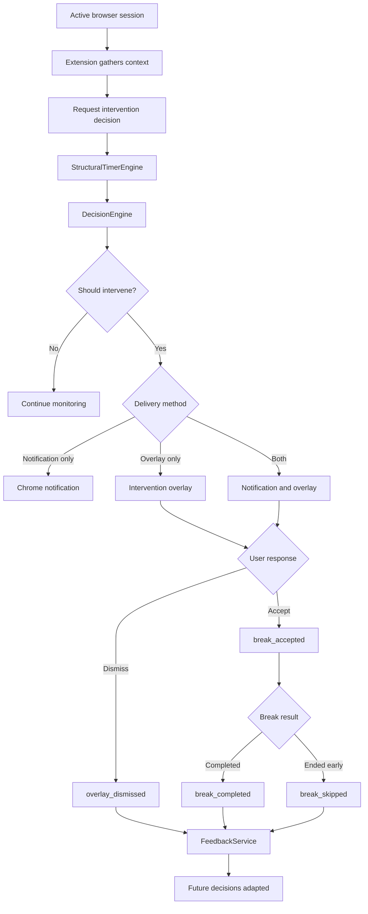

# HabitGuard JITAI and Intervention Logic

## 1. Purpose

This document explains how HabitGuard applies Just-In-Time Adaptive Intervention (JITAI) principles to digital overuse.

HabitGuard does not intervene only because a user has spent a fixed number of minutes on a website. It evaluates:

- the user's personal baseline,
- the current overuse gap,
- the active domain category,
- the duration of the current session,
- recent intervention history,
- user feedback,
- cooldown rules,
- whether the current moment is suitable for interruption.

The goal is to provide support at a useful moment without becoming repetitive or disruptive.

---

## 2. What Is a JITAI?

JITAI stands for:

```text
Just-In-Time Adaptive Intervention
```

A JITAI attempts to provide:

- the right intervention,
- to the right person,
- at the right time,
- in the right context,
- with the right intensity.

In HabitGuard, this means the system adapts intervention timing and strength instead of applying a universal block.

---

## 3. HabitGuard JITAI Components

A JITAI is often described using several conceptual components.

### 3.1 Distal Outcome

The long-term goal of HabitGuard is:

```text
Improve digital self-regulation and reduce unplanned overuse.
```

HabitGuard is intended to help users become more aware of their browsing behaviour and respond earlier to risky usage patterns.

### 3.2 Proximal Outcomes

Short-term outcomes include:

- reducing the current overuse gap,
- ending or pausing a risky session,
- accepting a short break,
- completing a break,
- reducing repeated dismissals,
- improving awareness of browsing behaviour.

### 3.3 Decision Points

A decision point is a moment when HabitGuard evaluates whether an intervention may be useful.

Examples include:

- a periodic background check,
- a session reaching a meaningful duration,
- usage rising above the personal baseline,
- entry into a temptation-category domain,
- expiry of an intervention cooldown.

The Chrome extension initiates these checks and requests a decision from the backend.

### 3.4 Tailoring Variables

Tailoring variables are the inputs used to personalise the decision.

HabitGuard considers values such as:

```text
baseline_usage_minutes
recent_usage_minutes
overuse_gap_minutes
rho_user
current_domain
current_category
session_minutes
break_acceptance_rate
dismissal_rate
last_intervention_time
cooldown_minutes
```

### 3.5 Intervention Options

HabitGuard can choose among:

```text
No intervention
Gentle check-in
Timer suggestion
Break prompt
Notification
Overlay
Notification and overlay
```

### 3.6 Decision Rules

Decision rules map the current state to an intervention response.

Conceptually:

```text
IF usage is above baseline
AND current context is risky
AND session duration is meaningful
AND cooldown has expired
THEN allow an intervention
```

The actual response is further adjusted using feedback history and delivery policy.

---

## 4. JITAI Processing Flow



---

## 5. Domain Context

HabitGuard supports four broad domain categories.

| Category | Meaning |
|---|---|
| `productive` | Mainly used for work, learning, coding, or focused tasks |
| `mixed` | Can be productive or distracting depending on purpose |
| `neutral` | Routine browsing with no strong risk assumption |
| `temptation` | Frequently associated with unplanned or compulsive use |

Examples:

```text
leetcode.com → productive
chatgpt.com → mixed
wikipedia.org → neutral or productive
youtube.com → mixed or temptation
instagram.com → temptation
```

These are not absolute labels. A user can classify a domain according to their own use.

Context affects friction strength.

```text
Productive context
→ soften or suppress intervention

Temptation context
→ stronger intervention may be allowed
```

---

## 6. Usage Status

The backend describes the current behavioural state using `usage_status`.

Representative values include:

| Usage Status | Interpretation |
|---|---|
| `STABLE` | Usage is within the expected range |
| `SLIGHTLY_ABOVE_BASELINE` | Usage has increased mildly |
| `HIGH_USAGE` | Usage is clearly above baseline |
| `RISKY_USAGE_SPIKE` | Usage is unusually high in a risky context |
| `PRODUCTIVE_CONTEXT` | Usage is high but current context appears productive |
| `FEEDBACK_SOFTENED_USER` | Intervention intensity was reduced due to low acceptance |

The exact status returned depends on the structural timer result and decision rules.

---

## 7. Friction Types

Friction represents how strongly HabitGuard attempts to interrupt the current behaviour.

### 7.1 NONE

```text
friction_type = NONE
```

Meaning:

- no prompt is needed,
- usage is stable,
- context is not risky,
- cooldown is active,
- calibration is incomplete.

### 7.2 SOFT_WARNING

```text
friction_type = SOFT_WARNING
```

Meaning:

- usage may be slightly elevated,
- the system offers a gentle check-in,
- interruption should remain minimal.

Example message:

```text
You have been here for a while. Is this still intentional?
```

### 7.3 TIMER_WARNING

```text
friction_type = TIMER_WARNING
```

Meaning:

- usage is meaningfully above baseline,
- HabitGuard recommends a short timer,
- the user remains in control.

Example message:

```text
You are above your usual usage. Consider a 10-minute limit.
```

### 7.4 STRONG_FRICTION

```text
friction_type = STRONG_FRICTION
```

Meaning:

- usage is substantially above baseline,
- the current session is sustained,
- the domain context is risky,
- a stronger break prompt is appropriate.

Example message:

```text
This session is far above your usual pattern. Take a short break.
```

---

## 8. Intervention Types

Representative intervention types include:

| Intervention Type | Purpose |
|---|---|
| `NONE` | Continue passive monitoring |
| `GENTLE_CHECKIN` | Ask whether usage is still intentional |
| `TIMER_NUDGE` | Suggest a temporary limit |
| `BREAK_PROMPT` | Encourage an immediate break |

The intervention type describes the behavioural action.

The friction type describes the intensity.

---

## 9. Decision and Delivery Separation

HabitGuard separates:

```text
Intervention decision
```

from:

```text
Intervention delivery
```

The backend may decide that an intervention is appropriate:

```text
should_intervene = true
```

while still choosing not to display an overlay:

```text
should_overlay = false
```

Possible reasons include:

- cooldown has not expired,
- the current tab is not eligible,
- the session is too short,
- the domain is productive,
- feedback indicates repeated rejection,
- notification-only delivery is more appropriate.

This separation prevents excessive overlays.

---

## 10. Delivery Flags

The backend returns explicit delivery fields.

### should_intervene

```text
should_intervene = true | false
```

Indicates whether HabitGuard recommends any intervention.

### should_notify

```text
should_notify = true | false
```

Indicates whether the extension may show a Chrome notification.

### should_overlay

```text
should_overlay = true | false
```

Indicates whether the extension may display an in-page overlay.

### cooldown_minutes

```text
cooldown_minutes = 25
```

Indicates how long the extension should wait before delivering another similar intervention.

---

## 11. Example Decision Response

```json
{
  "mode": "ACTIVE",
  "timer_active": true,
  "usage_status": "RISKY_USAGE_SPIKE",
  "friction_type": "STRONG_FRICTION",
  "intervention_type": "BREAK_PROMPT",
  "recommended_timer_minutes": 10,
  "baseline_usage_minutes": 22.1,
  "recent_usage_minutes": 52.0,
  "overuse_gap_minutes": 29.9,
  "rho_user": 0.05,
  "should_intervene": true,
  "should_notify": true,
  "should_overlay": true,
  "cooldown_minutes": 25,
  "decision_reason": "Usage is far above the personal baseline.",
  "delivery_reason": "Temptation context and sustained session permit strong friction."
}
```

---

## 12. Notification Behaviour

Notifications are less disruptive than overlays.

They are useful when:

- the system wants to raise awareness,
- strong interruption is unnecessary,
- feedback acceptance is low,
- an overlay would be too intrusive,
- the session is risky but not severe.

Notifications should be shown only when:

```text
should_intervene = true
AND should_notify = true
```

Cooldown rules prevent repeated notification spam.

---

## 13. Overlay Behaviour

Overlays create stronger friction.

They are appropriate when:

- usage is substantially above baseline,
- the active domain is risky,
- the session is sustained,
- cooldown has expired,
- the backend explicitly permits overlay delivery.

An overlay should be shown only when:

```text
should_intervene = true
AND should_overlay = true
```

The extension must not infer overlay permission from `friction_type` alone.

---

## 14. Break Flow

When the user accepts a break:

```text
break_accepted
```

is recorded.

The extension starts a break countdown.

Possible outcomes:

### Completed break

```text
break_completed
```

This means the countdown reached the end.

### Skipped break

```text
break_skipped
```

This means the user ended the accepted break before completion.

The system can use these outcomes to understand whether break prompts are realistic and useful.

---

## 15. Feedback Events

HabitGuard records four main events.

| Event | Trigger |
|---|---|
| `overlay_dismissed` | User closes the intervention overlay |
| `break_accepted` | User starts the proposed break |
| `break_completed` | Break countdown finishes |
| `break_skipped` | User exits the break early |

These events are sent from the extension to:

```http
POST /feedback/event
```

They are stored in SQLite and summarised by:

```http
GET /feedback/summary?user_id=local_user
```

---

## 16. Feedback Metrics

A simplified break acceptance rate is:

```math
AcceptanceRate =
AcceptedBreaks / (AcceptedBreaks + DismissedOverlays)
```

A simplified dismissal rate is:

```math
DismissalRate =
DismissedOverlays / (AcceptedBreaks + DismissedOverlays)
```

Example:

```text
overlay_dismissed = 3
break_accepted = 2
```

Then:

```math
AcceptanceRate = 2 / (2 + 3) = 0.40
```

```math
DismissalRate = 3 / (2 + 3) = 0.60
```

Therefore:

```text
break_acceptance_rate = 40%
dismissal_rate = 60%
```

---

## 17. Feedback Softening

A low acceptance rate may indicate that interventions are:

- too frequent,
- too strong,
- poorly timed,
- not useful in the current context.

The decision engine may soften future behaviour.

Example:

```text
usage_status = FEEDBACK_SOFTENED_USER
friction_type = SOFT_WARNING
should_overlay = false
should_notify = true
cooldown_minutes = 35
```

This preserves behavioural support while reducing interruption.

---

## 18. Cooldown Logic

Cooldowns prevent repetitive delivery.

A cooldown may be applied:

- per domain,
- per intervention type,
- after a notification,
- after an overlay,
- after feedback.

Conceptually:

```text
current_time - last_intervention_time < cooldown
→ suppress repeated delivery
```

Cooldowns are important because repeated prompts can cause:

- notification fatigue,
- user frustration,
- automatic dismissal,
- lower trust,
- extension removal.

---

## 19. Calibration Behaviour

During calibration:

```text
mode = CALIBRATION
timer_active = false
```

HabitGuard should not deliver active personalised interventions.

The system should instead:

- continue tracking,
- report calibration progress,
- avoid false precision,
- wait for sufficient history.

After calibration:

```text
mode = ACTIVE
timer_active = true
```

JITAI decisions can become fully personalised.

---

## 20. Productive Context Protection

HabitGuard must avoid penalising focused work.

Example:

```text
domain = leetcode.com
category = productive
session_minutes = 45
```

Even with a long session, the decision engine may:

- reduce friction,
- use a gentle check-in,
- suppress the overlay,
- lengthen cooldown,
- record productive context.

This protects users from being interrupted during intentional work.

---

## 21. Temptation Context Escalation

Example:

```text
domain = instagram.com
category = temptation
session_minutes = 18
overuse_gap_minutes = 35
```

Possible result:

```text
usage_status = RISKY_USAGE_SPIKE
friction_type = STRONG_FRICTION
intervention_type = BREAK_PROMPT
should_notify = true
should_overlay = true
```

This is appropriate because multiple risk indicators align.

---

## 22. Extension Delivery Rules

The extension should follow backend flags exactly.

### Notification rule

```text
Deliver notification only when:
should_intervene = true
AND should_notify = true
```

### Overlay rule

```text
Deliver overlay only when:
should_intervene = true
AND should_overlay = true
```

### No-delivery rule

```text
If should_intervene = false:
do not show notification
do not show overlay
```

This prevents frontend logic from contradicting the backend decision.

---

## 23. Failure Behaviour

### Backend unavailable

The extension should:

- keep local tracking active,
- avoid displaying fabricated decisions,
- retry later,
- avoid repeated error notifications.

### Invalid response

The extension should:

- treat missing delivery flags as false,
- avoid showing an overlay,
- log the error safely,
- continue local tracking.

### Content script unavailable

The extension should:

- avoid crashing,
- skip overlay delivery,
- preserve the decision result,
- retry on a later eligible tab.

---

## 24. Manually Verified Flow

The following chain has been manually verified:

```text
Natural browsing session
→ extension JITAI check
→ backend intervention request
→ should_intervene = true
→ should_overlay = true
→ natural overlay displayed
→ user dismissed overlay
→ overlay_dismissed sent
→ event stored in SQLite
→ feedback summary updated
```

Other verified events include:

```text
break_accepted
break_completed
break_skipped
```

---

## 25. Limitations

### Context is imperfect

A domain category cannot fully reveal why the user is browsing.

### Feedback is ambiguous

A dismissal may not always mean the intervention was poor.

### Timing is rule-based

Current timing rules are interpretable but not yet learned from long-term personalised data.

### Browser-only scope

HabitGuard does not yet observe complete smartphone or cross-device behaviour.

### No clinical validation

HabitGuard is an academic behavioural support system, not a clinical treatment or diagnosis tool.

---

## 26. Summary

HabitGuard implements JITAI principles through:

```text
personal baseline
+ current overuse
+ domain context
+ session duration
+ feedback history
+ cooldown
= adaptive intervention decision
```

The system aims to intervene only when support is likely to be useful and to reduce intervention strength when the user repeatedly rejects it.
