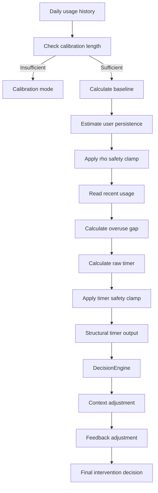

# HabitGuard Mathematical Model and Personal Calibration

## 1. Purpose

This document explains the mathematical reasoning used by HabitGuard to move from fixed screen-time limits toward personalised, behaviour-aware intervention decisions.

HabitGuard does not use a single universal limit such as:

```text
Block every user after 30 minutes.
```

Instead, it estimates a personal baseline from observed usage, compares recent behaviour with that baseline, calculates an overuse gap, and passes the result to the decision engine.

The mathematical model supports the live intervention loop:

```text
Observed usage
      ↓
Personal baseline
      ↓
Personal persistence estimate
      ↓
Overuse gap
      ↓
Suggested timer
      ↓
DecisionEngine
```

Machine-learning models do not control this live intervention process.

---

## 2. Research Foundation

HabitGuard is inspired by structural models of habit formation.

A simplified habit-stock relationship can be written as:

```math
s_{t+1} = \rho(s_t + x_t)
```

where:

- `s_t` is the user's existing habit stock at time `t`,
- `x_t` is the current usage amount,
- `rho` represents how strongly previous behaviour persists.

A larger `rho` means past behaviour has a stronger influence on the next period.

A smaller `rho` means behaviour is less persistent.

The research model used reference parameters including:

```text
rho = 0.299
eta = -2.68
zeta = 3.08
gamma = 1.09
```

HabitGuard treats these as theoretical reference values, not universal final values for every user.

---

## 3. Why Personalisation Is Necessary

A universal limit is weak because users have different normal patterns.

Example:

```text
User A normally browses for 20 minutes per day.
User B normally browses for 120 minutes per day.
```

A fixed 60-minute limit would:

- be too generous for User A,
- be too strict for User B,
- ignore the user's context,
- ignore recent behavioural change.

HabitGuard therefore first learns a user-specific baseline.

---

## 4. Calibration Period

HabitGuard begins in calibration mode.

```text
mode = CALIBRATION
timer_active = false
```

The current design requires approximately:

```text
10 days of usage history
```

During calibration:

- usage is collected passively,
- no personalised timer is enforced,
- baseline quality improves with more observations,
- the system reports how many days remain.

Example:

```text
days_available = 5
days_required = 10
days_remaining = 5
```

After sufficient history is available:

```text
mode = ACTIVE
timer_active = true
```

---

## 5. Personal Baseline

Let the user's daily usage history be:

```math
x_1, x_2, x_3, ..., x_n
```

The baseline can be represented conceptually as:

```math
B_u = f(x_1, x_2, ..., x_n)
```

where:

- `B_u` is the baseline usage for user `u`,
- `f` is the baseline calculation used by the implementation.

In practice, the system uses the user's collected history rather than a universal constant.

Example:

```text
Daily history:
18, 22, 21, 25, 20, 23, 24, 19, 22, 21 minutes
```

A representative baseline would be close to the user's normal range rather than an arbitrary external limit.

The backend exposes:

```text
baseline_usage_minutes
baseline_usage_hours
```

---

## 6. Recent Usage

Recent usage represents the current behaviour being evaluated.

The backend exposes:

```text
recent_usage_minutes
```

This may represent the current day or the recent usage window used by the structural timer.

---

## 7. Overuse Gap

The overuse gap compares recent usage with the personal baseline.

```math
G_u = R_u - B_u
```

where:

- `G_u` is the overuse gap,
- `R_u` is recent usage,
- `B_u` is baseline usage.

In implementation terms:

```text
overuse_gap_minutes =
recent_usage_minutes - baseline_usage_minutes
```

Example:

```text
baseline_usage_minutes = 22.1
recent_usage_minutes = 52.0
```

Then:

```math
52.0 - 22.1 = 29.9
```

Therefore:

```text
overuse_gap_minutes = 29.9
```

Interpretation:

```text
Gap <= 0
→ recent usage is not above baseline

Small positive gap
→ mild increase

Large positive gap
→ meaningful overuse may be present
```

The overuse gap alone does not automatically trigger an intervention. Context and feedback are also considered.

---

## 8. User-Specific Persistence

HabitGuard uses a user-specific persistence value:

```text
rho_user
```

This represents the estimated persistence of the individual's observed behaviour.

The system does not rely only on the research value:

```text
rho_paper_reference = 0.299
```

Instead, it derives a personal value from observed usage and applies safety bounds.

Example output:

```text
rho_user = 0.3251
```

or, after safety clamping:

```text
rho_user = 0.05
```

---

## 9. Safety Clamps

Mathematical models can produce unstable outputs when:

- history is insufficient,
- variation is extreme,
- a denominator approaches zero,
- the estimated persistence is outside a meaningful range,
- the calculated target becomes negative.

HabitGuard applies defensive bounds to avoid:

- negative timers,
- zero-minute recommendations,
- division singularities,
- unrealistic persistence,
- extreme intervention values.

Conceptually:

```math
rho_user = clamp(rho_estimated, rho_min, rho_max)
```

and:

```math
recommended_timer =
clamp(raw_timer, timer_min, timer_max)
```

This ensures that recommendations remain usable and safe.

---

## 10. Personalised Intercept

The research formulation included a user-specific intercept of the form:

```math
xi_i = -1.09 + 1.367 * x_bar_i1
```

where:

- `xi_i` is the user-specific intercept,
- `x_bar_i1` represents an observed average usage measure.

HabitGuard uses this idea as part of its personalisation logic rather than treating all users identically.

The final implementation also applies safety handling when derived values would produce unrealistic targets.

---

## 11. Timer Recommendation

The timer recommendation is not a fixed constant.

It depends on values such as:

```text
baseline_usage_minutes
recent_usage_minutes
overuse_gap_minutes
rho_user
context
feedback history
```

The structural timer produces:

```text
recommended_timer_minutes
```

Example:

```text
recommended_timer_minutes = 10
```

This value is then interpreted by the decision engine.

A recommended timer does not guarantee that an overlay will appear.

The decision engine may still return:

```text
should_intervene = false
```

or:

```text
should_overlay = false
```

because delivery depends on context, cooldown, and feedback.

---

## 12. Context Adjustment

Mathematical overuse is not enough by itself.

The same overuse gap may be interpreted differently based on context.

Example:

```text
recent_usage = 50 minutes
baseline = 25 minutes
overuse_gap = 25 minutes
```

Case 1:

```text
current_category = productive
```

Possible result:

```text
SOFT_WARNING
or no overlay
```

Case 2:

```text
current_category = temptation
```

Possible result:

```text
TIMER_WARNING
or STRONG_FRICTION
```

Therefore:

```text
Mathematical model
+ context
+ current session
+ feedback
= final intervention decision
```

---

## 13. Feedback Adjustment

Feedback history changes how aggressively HabitGuard delivers interventions.

Suppose:

```text
break_acceptance_rate = 0.14
dismissal_rate = 0.86
```

The decision engine may interpret this as evidence that the current intervention strategy is not being accepted.

Possible adaptation:

```text
usage_status = FEEDBACK_SOFTENED_USER
friction_type = SOFT_WARNING
longer cooldown
fewer overlays
```

This does not erase the overuse calculation.

It modifies how the intervention is delivered.

---

## 14. Mathematical Decision Flow



---

## 15. Example Calculation

Assume:

```text
baseline_usage_minutes = 22.1
recent_usage_minutes = 52.0
rho_user = 0.05
current_category = temptation
break_acceptance_rate = 0.14
```

First:

```math
overuse_gap = 52.0 - 22.1 = 29.9
```

The structural timer may recommend:

```text
recommended_timer_minutes = 10
```

The decision engine then considers:

```text
large positive overuse gap
temptation context
low acceptance rate
cooldown state
current session duration
```

Possible output:

```text
usage_status = FEEDBACK_SOFTENED_USER
friction_type = TIMER_WARNING
intervention_type = TIMER_NUDGE
should_intervene = true
should_overlay = false
should_notify = true
```

This example shows why the mathematical result and delivery result are separate.

---

## 16. Calibration Limitations

The calibration model has limitations.

### Unusual calibration period

If the first 10 days are not representative, the baseline may be misleading.

Examples:

- exam week,
- vacation,
- illness,
- temporary project deadline,
- unusual entertainment binge.

### Browser-only view

The baseline currently reflects supported browser usage, not complete smartphone or cross-device behaviour.

### Limited context understanding

Domain categories improve interpretation, but they do not fully reveal user intent.

### Feedback ambiguity

A dismissal does not always mean the intervention was ineffective.

The user may dismiss it because:

- they are in a meeting,
- they are presenting,
- they intend to stop soon,
- the current task is important,
- the reminder is poorly timed.

---

## 17. Difference Between Model and ML

The structural timer is mathematical and rule-based.

```text
StructuralTimerEngine
→ baseline
→ persistence
→ overuse gap
→ timer recommendation
```

The machine-learning models are supporting analytics.

```text
Risk classifier
Anomaly detector
User segmentation
Usage forecaster
```

The live intervention loop does not depend on ML predictions.

This separation improves:

- explainability,
- reliability,
- safety,
- testability,
- resistance to model failure.

---

## 18. Summary

HabitGuard replaces a universal fixed limit with a personalised process:

```text
Collect usage
→ build baseline
→ estimate persistence
→ calculate overuse gap
→ recommend timer
→ adjust using context
→ adjust using feedback
→ deliver intervention only when appropriate
```

The central mathematical idea is that overuse should be measured relative to the user's own observed behaviour, not against a single arbitrary limit for everyone.
