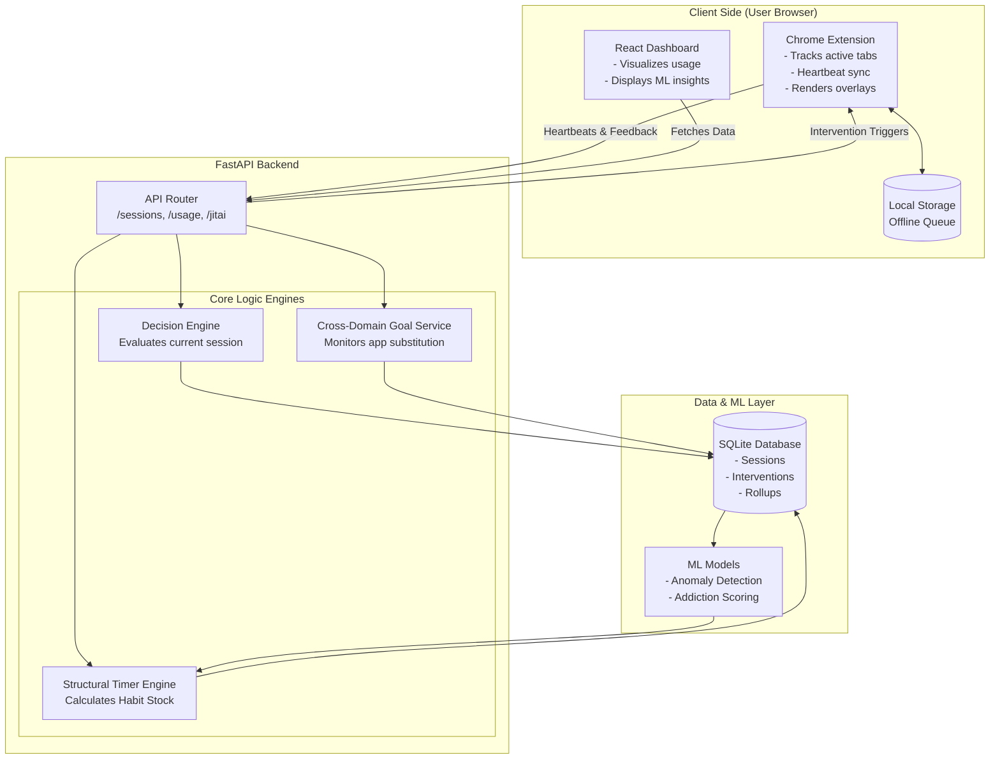
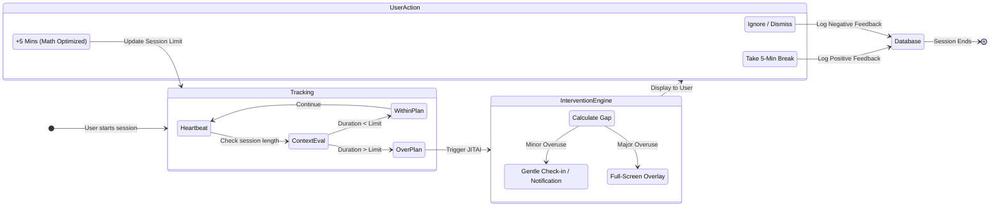
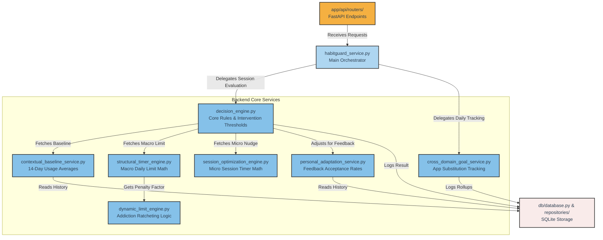

# HabitGuard 🛡️

> A privacy-conscious, JITAI-inspired digital wellbeing system that mathematically models addiction habits and delivers highly optimized, non-linear intervention timers.

HabitGuard combines a Chrome extension, FastAPI backend, SQLite database, React dashboard, and a rigorous non-linear mathematical optimization engine to prevent digital overuse.

---

## 🚀 Live Demos & Deployment Links

*   **Live Dashboard:** `[Insert Production Dashboard URL Here]`
*   **API Documentation:** `[Insert Production Backend /docs URL Here]`
*   **Chrome Extension:** `[Insert Chrome Web Store Link Here]`

---

## 📸 Quick Glimpse

*Use this space to insert 3-4 screenshots or a short GIF demonstrating the extension in action!*

| The Intervention Overlay | The Dashboard Analytics | The Notification Nudge |
| :---: | :---: | :---: |
| `[Insert Overlay Image]` | `[Insert Dashboard Image]` | `[Insert Notification Image]` |

---

## 🧩 Total System Architecture

HabitGuard is divided into three distinct layers: the Client (Chrome Extension & Dashboard), the FastAPI Backend (Math Engines), and the Storage/ML layer.



---

## 🧮 Mathematical Execution Architecture

HabitGuard replaces static "30-minute limits" with a dynamic mathematical system based on habit-formation literature. It is split into two engines:

1.  **Macro Engine (Daily Limit):** Calculates your baseline usage and uses autocorrelation (ρ) to determine your "Habit Stock". It outputs a safe, step-down daily limit constraint (p).
2.  **Micro Engine (Per-Session Nudge):** When you exceed a timer, it runs a grid-search optimizer to balance the utility of browsing against the cost of temptation and the penalty of exceeding your macro daily limit (p). 

```mermaid
flowchart TD
    %% Define styles for mathematical blocks
    classDef mathBlock fill:#e8f4f8,stroke:#2980b9,stroke-width:2px,color:#2c3e50
    classDef dbBlock fill:#f9ebea,stroke:#c0392b,stroke-width:2px,color:#2c3e50
    classDef outputBlock fill:#d5f5e3,stroke:#27ae60,stroke-width:2px,color:#2c3e50

    subgraph DailyData ["1. Historical Data (Database)"]
        H1[Daily Usage Rollups\n(Past 14 Days)]:::dbBlock
        H2[Past Intervention Feedback\n(Accept/Reject Rates)]:::dbBlock
    end

    subgraph MacroEngine ["2. StructuralTimerEngine (Daily Limit)"]
        M1["Calculate Autocorrelation (ρ)\nρ = Corr(Usage_t, Usage_t-1)"]:::mathBlock
        M2["Calculate Habit Stock (S_t)\nS_t = ρ * S_{t-1} + Usage_{t-1}"]:::mathBlock
        M3["Calculate Bound/Target\nTarget = max(0, Natural - Penalty)"]:::mathBlock
        
        M1 --> M2
        M2 --> M3
    end

    subgraph MicroEngine ["3. SessionOptimizationEngine (Per-Session)"]
        O1["Utility Term\n+ α * log(1 + x)"]:::mathBlock
        O2["Temptation Cost\n- β * T * x"]:::mathBlock
        O3["Plan Deviation Penalty\n- λ * (x - p)^2"]:::mathBlock
        
        O4["Objective Function (Non-Linear Optimizer)\nMaximize: U(x) = Utility - Temptation - Deviation"]:::mathBlock
        
        O1 --> O4
        O2 --> O4
        O3 --> O4
    end

    subgraph Outputs ["4. User-Facing Interventions (Where it's visible)"]
        Out1["Dynamic Daily Limit\n👀 Dashboard ML Panel\n👀 Overlay 'Recommended Timer'"]:::outputBlock
        Out2["Per-Session Nudge\n👀 Chrome Notification Buttons\n👀 Overlay Extension Options"]:::outputBlock
    end

    %% Flow connections
    H1 --> M1
    M3 --> Out1
    
    Out1 --> |Sets macro boundary for (p)| O3
    H2 --> |Tuning α, β, λ| O4
    
    O4 --> |Grid-Search Optimization| Out2
```

---

## ⚙️ The JITAI Feedback Loop

**Just-In-Time Adaptive Interventions (JITAI)** ensure that users are only interrupted when absolutely necessary. The `DecisionEngine` constantly monitors the heartbeat of the active session.



---

## 📂 Backend File Architecture (Python Services)

For developers exploring the repository, here is how the core Python services interact:



---

## 🛠️ Local Installation & Setup

1. **Clone & Backend Setup:**
    ```bash
    git clone https://github.com/shreshta312/habitguard.git
    cd habitguard/backend
    pip install -r requirements.txt
    python -m uvicorn app.main:app --host 127.0.0.1 --port 8000
    ```

2. **Dashboard Setup:**
    ```bash
    cd ../dashboard
    npm install
    npm run dev
    ```

3. **Chrome Extension:**
    * Go to `chrome://extensions` in Google Chrome.
    * Enable **Developer mode**.
    * Click **Load unpacked** and select the `chrome_extension/` directory.

4. **Run Simulation (Optional):**
    To populate the database with realistic 14-day history for testing:
    ```bash
    python demo_simulator.py --auto
    ```

---

## 🛡️ Project Status (Version 2.0)

- ✔️ **Final Stabilization Completed:** All mathematical engines mathematically verified and boundaries clamped.
- ✔️ **Test Suite Passed:** 201/201 automated tests passing across Core, Math, and ML.
- ✔️ **Simulations Completed:** End-to-end `demo_simulator.py` verifies all JITAI scenarios seamlessly.
- **Pending:** Production deployment and academic colloquium presentation.

*Developed by Shreshta Bharathi*
