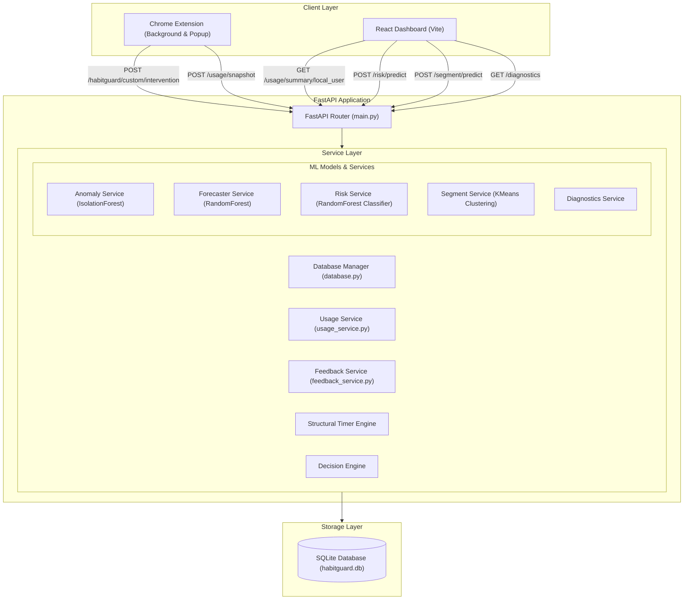

# HabitGuard

HabitGuard is an intelligent, privacy-preserving digital wellbeing dashboard and browser assistant. It uses Just-In-Time Adaptive Interventions (JITAI) and offline Machine Learning models to analyze usage patterns, predict future screen time, detect anomalies, and personalize friction strategies to curb mindless browsing.

---

## System Architecture



### 1. Browser Assistant (Chrome Extension)
*   **Active Monitoring**: Tracks browser session times and classifies active domain categories (Productive, Temptation, Neutral, Mixed).
*   **JITAI Hook**: Sends Chrome session state to the backend to check if friction or interventions are needed.
*   **Popup UI**: Offers manual status check, categories adjustments, active break timers, and visual JITAI delivery policies.

### 2. Live Dashboard (React Frontend)
*   **Digital Wellbeing Mood Avatar**: Renders a dynamic mood avatar (SVG) based on real usage metrics and user interaction.
*   **ML Insights**: Displays real-time Anomaly status and Tomorrow's usage forecast with confidence labels.
*   **Behavioral Questionnaire**: Captures profile features locally and calls risk/segmentation endpoints to predict wellbeing metrics.
*   **Model Diagnostics**: Offers a collapsible inspection panel displaying loaded ML model metadata.

### 3. Backend Engine (FastAPI)
*   **StructuralTimerEngine**: Tracks historic baseline usage and computes a personalized, dynamic limit calibration.
*   **DecisionEngine**: Integrates feedback history (ignores, acceptances) and current context to decide if intervention friction is appropriate.
*   **Reliability Layer**: Gracefully handles feature mismatches (estimating launches and interactions) and missing ML history.
*   **SQLite Persistence Manager**: Swaps JSONL files on startup, migrating historic snapshots to a structured database layer.

---

## Machine Learning Integration

The system runs four core ML models under the `ml/saved_models/` folder:

1.  **Usage Forecaster (`usage_forecaster.pkl`)**:
    *   **Type**: RandomForestRegressor
    *   **Features**: `usage_lag_1` (today), `usage_lag_2` (yesterday), `usage_lag_3` (2 days ago), `usage_rolling_mean_3`, `launches_lag_1`, `interactions_lag_1`, `is_productive`.
    *   **Fallback**: If less than 3 days of history are available, the service estimates tomorrow's forecast using a moving average and marks the prediction confidence as `LOW`.

2.  **Anomaly Detector (`anomaly_detector.pkl` & `anomaly_scaler.pkl`)**:
    *   **Type**: IsolationForest
    *   **Features**: `screen_time_min`, `launches`, `interactions`, `is_productive`.
    *   **Heuristic Matching**: Extension data does not directly supply `launches` and `interactions`. To prevent scikit-learn feature mismatches honestly, the `UsageService` estimates launches from session counts and models interactions using a multiplier (`screenTime * 15`), disclosing this estimate on the dashboard.

3.  **Risk Classifier (`risk_classifier.pkl`)**:
    *   **Type**: RandomForestClassifier
    *   **Features**: 13 demographic and behavioral indicators (age, sleep hours, stress level, average social media/gaming time, app opens).
    *   **Output**: Classifies the user into `LOW` or `HIGH` overall addiction risk.

4.  **User Segmentation (`user_segmentation.pkl`)**:
    *   **Type**: KMeans Clustering
    *   **Features**: Same 13 profile indicators.
    *   **Output**: Maps user features to standard segments: *Casual User*, *Productivity Focused*, *Heavy Distracted*, or *Late Night / High Usage*.

---

## Installation & Setup

### Prerequisites
*   Python 3.10+
*   Node.js v18+

### 1. Backend Server Setup
Navigate to the `backend/` directory:
```bash
# Install dependencies
pip install -r requirements.txt

# Start backend server
python -m uvicorn app.main:app --host 127.0.0.1 --port 8000
```
*Note: On first startup, the database service automatically migrates any legacy `.jsonl` files in `backend/data/` to the new SQLite database (`habitguard.db`) and archives the source files.*

### 2. Dashboard Frontend Setup
Navigate to the `dashboard/` directory:
```bash
# Install dependencies
npm install

# Start Vite dev server
npm run dev
```
Open `http://localhost:5173/` in your browser.

### 3. Extension Setup
1.  Open Chrome and navigate to `chrome://extensions/`.
2.  Enable **Developer mode** (top-right toggle).
3.  Click **Load unpacked** (top-left button).
4.  Select the `chrome_extension/` directory in this project.

---

## System Limitations & Disclosures

### Privacy First
All profiling questionnaires are saved in `localStorage` on your client browser. Profiles are processed by the backend only upon submission and are never saved to the database.

### Feature Estimation Disclosures
The extension runs locally and tracks domain visits. To run the Anomaly IsolationForest model, the system maps session starts to "launches" and approximates click/keystroke "interactions" mathematically. These are rough indicators, not literal device-level counts.

### SQLite Migration
The file-based JSONL database was migrated to a local SQLite schema for relational consistency and concurrent writes. The original data resides safely under archived backup extensions (`.bak`) in `backend/data/`.
