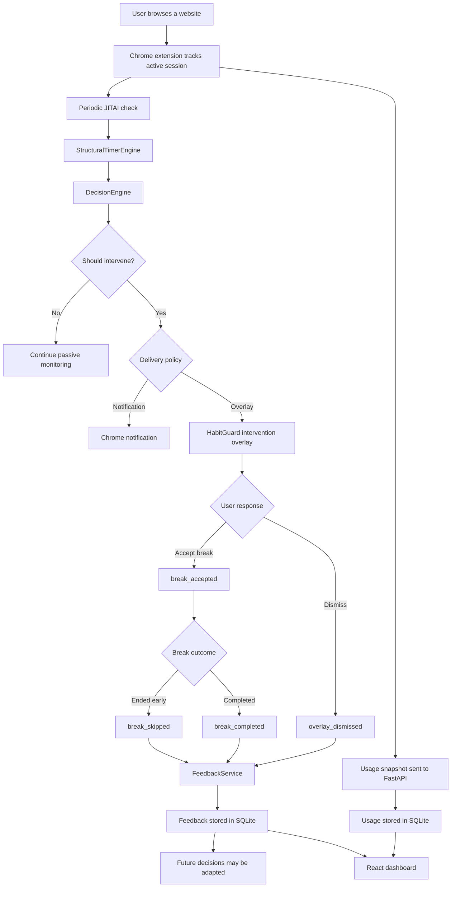
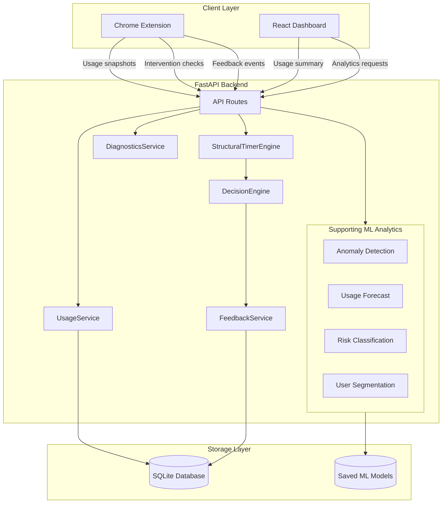

# HabitGuard

> A privacy-conscious, JITAI-inspired digital wellbeing system that observes browser usage, learns a personal baseline, detects risky usage patterns, and delivers adaptive interventions at appropriate moments.

HabitGuard combines a Chrome extension, FastAPI backend, SQLite database, React dashboard, mathematical calibration engine, feedback loop, and supporting machine-learning analytics.

The main intervention system is not controlled by machine learning. Live interventions are produced by:

```text
StructuralTimerEngine
        ↓
DecisionEngine
        ↓
Context and delivery policy
        ↓
Chrome notification or overlay
        ↓
User feedback
        ↓
Future intervention adaptation
```

Machine-learning models are used only as supporting analytics for the dashboard.

---

## Table of Contents

1. [Why HabitGuard](#why-habitguard)
2. [Problem Statement](#problem-statement)
3. [Project Objectives](#project-objectives)
4. [Core Features](#core-features)
5. [System Workflow](#system-workflow)
6. [Research and Mathematical Foundation](#research-and-mathematical-foundation)
7. [Personal Calibration](#personal-calibration)
8. [JITAI Intervention Logic](#jitai-intervention-logic)
9. [Feedback Adaptation](#feedback-adaptation)
10. [System Architecture](#system-architecture)
11. [Project Components](#project-components)
12. [Machine-Learning Analytics](#machine-learning-analytics)
13. [Technology Stack](#technology-stack)
14. [Project Structure](#project-structure)
15. [Installation](#installation)
16. [Running HabitGuard](#running-habitguard)
17. [API Overview](#api-overview)
18. [Testing and Verification](#testing-and-verification)
19. [Privacy and Ethical Design](#privacy-and-ethical-design)
20. [Current Limitations](#current-limitations)
21. [Future Scope](#future-scope)
22. [Project Status](#project-status)

---

## Why HabitGuard

Digital platforms are designed to keep users engaged through notifications, infinite scrolling, recommendations, short-form content, and rapid reward cycles.

Screen time alone does not explain whether usage is harmful. The same application may be:

- productive during work or study,
- neutral during routine browsing,
- mixed when it serves multiple purposes,
- tempting when it encourages unplanned or compulsive use.

Most digital wellbeing tools rely on fixed limits such as:

```text
Block YouTube after 30 minutes
```

A fixed limit does not consider:

- the user's normal usage pattern,
- whether the current session is productive,
- recent changes in behaviour,
- the duration of the current session,
- whether previous interventions were accepted,
- whether the user is repeatedly dismissing reminders,
- whether the current moment is suitable for interruption.

HabitGuard addresses this problem by learning a personal usage baseline and delivering interventions only when usage, context, and timing indicate that support may be useful.

---

## Problem Statement

Existing screen-time tools often have three major limitations:

1. **Static limits**

   The same limit is applied regardless of the user's normal behaviour or current context.

2. **Context-insensitive decisions**

   Productive research and mindless scrolling may be treated identically.

3. **Poor intervention timing**

   Notifications may appear too frequently, too late, or at moments when the user is unlikely to respond positively.

HabitGuard aims to build a personalised digital wellbeing assistant that:

- observes usage passively,
- learns an individual baseline,
- identifies meaningful overuse,
- considers the active website category,
- adapts intervention strength,
- learns from user feedback,
- avoids unnecessary interruptions.

---

## Project Objectives

The main objectives of HabitGuard are:

- track browser usage locally,
- build a personalised usage baseline,
- avoid applying arbitrary universal limits,
- distinguish productive, mixed, neutral, and temptation contexts,
- detect sustained and unusual usage,
- calculate a personalised timer recommendation,
- deliver notifications and overlays through a Chrome extension,
- record whether interventions are accepted or dismissed,
- adapt future friction using feedback,
- visualise usage through a live dashboard,
- provide supporting ML-based risk, anomaly, segmentation, and forecast analytics,
- preserve user privacy by avoiding raw browsing-content collection.

HabitGuard is intended as a behavioural support tool. It is not a medical diagnosis system.

---

## Core Features

### Browser usage tracking

The Chrome extension records:

- active domain,
- current session duration,
- daily domain usage,
- total daily browser usage,
- session history,
- user-assigned domain category.

It does not inspect page text, private messages, passwords, or form content.

### Personalised calibration

HabitGuard begins in calibration mode and collects usage history before enabling active interventions.

The current calibration period is approximately:

```text
10 days
```

### Context-aware decisions

The current domain can be classified as:

- `productive`
- `mixed`
- `neutral`
- `temptation`

A long productive session should not receive the same treatment as a long temptation session.

### Adaptive intervention levels

HabitGuard supports multiple friction levels:

- `NONE`
- `SOFT_WARNING`
- `TIMER_WARNING`
- `STRONG_FRICTION`

### JITAI delivery policy

An intervention is delivered only when the decision engine and context policy permit it.

The backend returns fields such as:

- `should_intervene`
- `should_notify`
- `should_overlay`
- `cooldown_minutes`
- `delivery_reason`

### Feedback loop

The extension records:

- overlay dismissed,
- break accepted,
- break completed,
- break skipped.

These events influence future adaptation.

### Dashboard analytics

The dashboard displays information such as:

- current screen time,
- personalised baseline,
- overuse gap,
- suggested timer,
- usage trend,
- domain usage,
- intervention counts,
- active session,
- anomaly status,
- forecasted usage,
- risk and user-segment results.

---

## System Workflow



---

## Research and Mathematical Foundation

HabitGuard is inspired by structural models of habit formation and behavioural adaptation.

A simplified habit-stock relationship can be represented as:

```math
s_{t+1} = \rho(s_t + x_t)
```

where:

- `s_t` is the existing habit stock,
- `x_t` is current usage,
- `ρ` represents persistence of past behaviour.

A larger value of `ρ` indicates that previous usage has a stronger influence on future behaviour.

The research model used reference parameters including:

```text
ρ = 0.299
η = -2.68
ζ = 3.08
γ = 1.09
```

HabitGuard does not treat these paper values as universal final limits.

They are used as theoretical references and priors. The implemented system derives user-specific behaviour from observed usage history and applies safety clamps where required.

### User-specific behaviour

The project uses a personalised parameter:

```text
rho_user
```

This represents the estimated persistence of an individual user's browsing behaviour.

The calculated value is bounded to prevent:

- unstable values,
- negative limits,
- division-related singularities,
- unrealistic timer recommendations.

### Baseline usage

The baseline is derived from the user's collected daily history.

Conceptually:

```math
B_u = baseline usage for user u
```

Recent usage is compared with this baseline:

```math
G_u = R_u - B_u
```

where:

- `R_u` is recent usage,
- `B_u` is baseline usage,
- `G_u` is the overuse gap.

Therefore:

```text
overuse_gap_minutes = recent_usage_minutes - baseline_usage_minutes
```

When the gap is small or negative, strong intervention is usually unnecessary.

When the gap is large and the current context is risky, stronger support may be recommended.

---

## Personal Calibration

HabitGuard has two major operating modes.

### Calibration mode

```text
mode = CALIBRATION
timer_active = false
```

During calibration:

- usage is collected passively,
- no personalised timer is enforced,
- the system waits for sufficient history,
- the user is informed about remaining calibration days.

Example:

```text
Collecting baseline data. 5 more days needed.
```

### Active mode

```text
mode = ACTIVE
timer_active = true
```

After enough history is collected, HabitGuard can calculate:

- baseline usage,
- recent usage,
- overuse gap,
- personalised persistence,
- suggested timer duration,
- intervention strength.

This prevents HabitGuard from applying a fixed limit immediately after installation.

---

## JITAI Intervention Logic

JITAI stands for:

```text
Just-In-Time Adaptive Intervention
```

A JITAI attempts to provide the right intervention:

- to the right person,
- at the right time,
- in the right context,
- with an appropriate intensity.

HabitGuard uses four main decision dimensions.

### 1. Usage state

Examples include:

- `STABLE`
- `SLIGHTLY_ABOVE_BASELINE`
- `HIGH_USAGE`
- `RISKY_USAGE_SPIKE`
- `PRODUCTIVE_CONTEXT`
- `FEEDBACK_SOFTENED_USER`

### 2. Current context

The extension sends context such as:

```json
{
  "current_domain": "youtube.com",
  "current_category": "temptation",
  "session_minutes": 12
}
```

### 3. Intervention strength

The decision engine can return:

| Friction type | Meaning |
|---|---|
| `NONE` | No interruption |
| `SOFT_WARNING` | Gentle check-in |
| `TIMER_WARNING` | Recommend a timer |
| `STRONG_FRICTION` | Strong break or stopping prompt |

Associated intervention types include:

- `NONE`
- `GENTLE_CHECKIN`
- `TIMER_NUDGE`
- `BREAK_PROMPT`

### 4. Delivery policy

The backend separately decides whether the intervention should be delivered as:

- a notification,
- an overlay,
- both,
- neither.

Example response:

```json
{
  "should_intervene": true,
  "should_notify": true,
  "should_overlay": true,
  "friction_type": "STRONG_FRICTION",
  "intervention_type": "BREAK_PROMPT",
  "cooldown_minutes": 25,
  "delivery_reason": "Temptation context with sustained session and overuse detected."
}
```

The distinction between deciding an intervention and delivering it helps prevent noisy or inappropriate interruptions.

---

## Feedback Adaptation

HabitGuard records four main feedback events:

| Event | Meaning |
|---|---|
| `overlay_dismissed` | The intervention overlay was dismissed |
| `break_accepted` | The user accepted a break |
| `break_completed` | The break countdown completed |
| `break_skipped` | The accepted break was ended early |

A simplified acceptance rate is:

```math
AcceptanceRate =
AcceptedBreaks / (AcceptedBreaks + DismissedOverlays)
```

Feedback is used to understand whether the current intervention policy is effective.

For example:

- repeated acceptance may support maintaining the current strategy,
- repeated dismissal may indicate excessive interruption,
- a low acceptance rate may soften future intervention delivery,
- cooldowns reduce repeated prompts within a short period.

Feedback adaptation modifies delivery behaviour. It does not replace the structural usage model.

---

## System Architecture



---

## Project Components

### Chrome extension

Location:

```text
chrome_extension/
```

Important files:

```text
background.js
content.js
popup.js
popup.html
popup.css
manifest.json
```

Responsibilities:

- monitor browser sessions,
- store local usage state,
- classify domain context,
- call the backend intervention endpoint,
- display notifications,
- display overlays,
- run break countdowns,
- send feedback events,
- synchronise usage snapshots.

### FastAPI backend

Location:

```text
backend/
```

Responsibilities:

- receive usage data,
- calculate personalised intervention values,
- apply decision policies,
- store snapshots,
- store feedback,
- provide dashboard summaries,
- serve analytics endpoints,
- expose diagnostics.

### SQLite database

The database stores structured project data such as:

- usage snapshots,
- feedback events,
- intervention-related records.

Local database files should not be committed to GitHub.

### React dashboard

Location:

```text
dashboard/
```

Responsibilities:

- show current usage,
- display trends and domain statistics,
- show intervention state,
- present anomaly and forecast analytics,
- support risk and segmentation questionnaires,
- expose model diagnostics.

The dashboard is a monitoring and explanation layer. It does not directly control the live intervention engine.

### Machine-learning module

Location:

```text
ml/
```

Responsibilities:

- train analytics models,
- save model pipelines,
- evaluate model behaviour,
- provide supporting predictions through backend services.

---

## Machine-Learning Analytics

Machine learning is intentionally separated from the live intervention loop.

```text
Live intervention:
StructuralTimerEngine → DecisionEngine

Supporting analytics:
Risk + Segmentation + Anomaly + Forecast
```

### Risk classifier

Model type:

```text
RandomForestClassifier
```

Purpose:

- estimate broad behavioural risk from questionnaire features.

Output:

```text
LOW
HIGH
```

The training pipeline includes preprocessing so that live questionnaire data is transformed consistently with training data.

This is an educational risk estimate, not a clinical diagnosis.

### User segmentation

Model type:

```text
KMeans
```

Purpose:

- group questionnaire profiles into broad behavioural patterns.

The pipeline includes imputation and scaling before clustering.

Final model retraining and end-to-end verification should be completed before treating segment names as stable project results.

### Anomaly detection

Model type:

```text
IsolationForest
```

Features include:

- screen time,
- launches,
- interactions,
- productivity indicator.

The Chrome extension does not directly record clicks or keypresses.

Therefore:

- launches are approximated from session data,
- interactions are estimated from screen time,
- these values are disclosed as estimates,
- anomaly results are supporting indicators only.

### Usage forecasting

Model type:

```text
RandomForestRegressor
```

Example features:

- `usage_lag_1`
- `usage_lag_2`
- `usage_lag_3`
- `usage_rolling_mean_3`
- `launches_lag_1`
- `interactions_lag_1`
- `is_productive`

Forecasting is experimental and does not control interventions.

Previous evaluation showed that forecasting generalisation remains limited, so the model is presented as an exploratory dashboard feature rather than a reliable behavioural prediction system.

---

## Technology Stack

### Backend

- Python
- FastAPI
- Uvicorn
- Pydantic
- SQLite
- Pytest
- scikit-learn
- pandas
- NumPy
- joblib

### Frontend dashboard

- React
- Vite
- JavaScript
- Recharts
- Lucide React
- CSS

### Browser extension

- Chrome Extension Manifest V3
- JavaScript
- Chrome Storage API
- Chrome Tabs API
- Chrome Notifications API
- Chrome Alarms API

### Machine learning

- Random Forest Classification
- Random Forest Regression
- Isolation Forest
- KMeans Clustering
- StandardScaler
- SimpleImputer

---

## Project Structure

```text
habitguard/
├── backend/
│   ├── app/
│   │   ├── api/
│   │   ├── services/
│   │   ├── schemas/
│   │   ├── database.py
│   │   └── main.py
│   ├── data/
│   ├── tests/
│   └── requirements.txt
│
├── chrome_extension/
│   ├── background.js
│   ├── content.js
│   ├── popup.js
│   ├── popup.html
│   ├── popup.css
│   └── manifest.json
│
├── dashboard/
│   ├── src/
│   ├── public/
│   ├── package.json
│   └── vite.config.js
│
├── ml/
│   ├── src/
│   │   └── models/
│   ├── saved_models/
│   └── data/
│
├── README.md
└── .gitignore
```

The exact directory contents may evolve as the project is cleaned for release.

---

## Installation

### Prerequisites

Install:

- Python 3.10 or newer,
- Node.js 18 or newer,
- Google Chrome,
- Git.

Clone the repository:

```bash
git clone https://github.com/shreshta312/habitguard.git
cd habitguard
```

---

## Running HabitGuard

Start the components in this order:

```text
1. FastAPI backend
2. React dashboard
3. Chrome extension
```

### 1. Start the backend

Open a terminal:

```bash
cd backend
pip install -r requirements.txt
python -m uvicorn app.main:app --host 127.0.0.1 --port 8000
```

Backend URL:

```text
http://127.0.0.1:8000
```

FastAPI documentation:

```text
http://127.0.0.1:8000/docs
```

### 2. Start the dashboard

Open a second terminal:

```bash
cd dashboard
npm install
npm run dev
```

Dashboard URL:

```text
http://localhost:5173
```

Production build check:

```bash
npm run build
```

### 3. Load the Chrome extension

1. Open Chrome.
2. Navigate to:

```text
chrome://extensions
```

3. Enable **Developer mode**.
4. Click **Load unpacked**.
5. Select:

```text
chrome_extension/
```

6. Refresh any already-open website tabs so the content script is injected.

---

## API Overview

### Intervention

#### Custom intervention decision

```http
POST /habitguard/custom/intervention
```

Used by the Chrome extension to request a personalised intervention decision.

### Usage

#### Save usage snapshot

```http
POST /usage/snapshot
```

#### Retrieve dashboard summary

```http
GET /usage/summary/local_user
```

#### Retrieve daily history

```http
GET /usage/daily-history/local_user
```

### Feedback

#### Record feedback event

```http
POST /feedback/event
```

Supported event types:

```text
overlay_dismissed
break_accepted
break_completed
break_skipped
```

#### Retrieve feedback summary

```http
GET /feedback/summary?user_id=local_user
```

### Supporting analytics

```http
POST /risk/predict
POST /segment/predict
GET /diagnostics
```

The interactive FastAPI documentation should be treated as the final source for request and response schemas.

---

## Testing and Verification

Run backend tests:

```bash
cd backend
python -m pytest -v
```

A previous project test run reached:

```text
56 passed
```

A final test run should be completed before creating the release tag.

### Manually verified integration flow

The following complete workflow has been manually tested:

```text
Chrome extension
→ intervention request
→ StructuralTimerEngine
→ DecisionEngine
→ STRONG_FRICTION response
→ natural overlay delivery
→ overlay dismissal
→ feedback API
→ SQLite storage
→ feedback summary
```

Verified feedback events include:

- overlay dismissal,
- break acceptance,
- break completion,
- early break ending.

The natural JITAI test returned fields including:

```text
should_intervene = true
should_overlay = true
should_notify = true
friction_type = STRONG_FRICTION
usage_status = RISKY_USAGE_SPIKE
```

The dashboard summary endpoint has also been verified to return:

- live usage totals,
- seven-day trend,
- top domains,
- current session,
- latest intervention,
- session statistics,
- intervention statistics,
- extension event statistics,
- anomaly result,
- forecast result.

### Dashboard build verification

```bash
cd dashboard
npm run build
```

The current dashboard completes a production build successfully.

The generated bundle-size warning is an optimisation warning and does not prevent the application from building.

---

## Privacy and Ethical Design

HabitGuard follows a privacy-conscious design.

### Data that may be stored

- domain names,
- session duration,
- daily usage totals,
- domain categories,
- intervention results,
- feedback events,
- questionnaire values submitted for analytics.

### Data not intentionally collected

- page content,
- passwords,
- private messages,
- form text,
- keystrokes,
- browser history outside extension tracking,
- medical records.

### Questionnaire handling

Questionnaire values are used to generate analytics results.

They should not be described as medical or psychological diagnoses.

### Ethical intervention principles

HabitGuard attempts to:

- avoid excessive interruption,
- apply cooldowns,
- soften ineffective interventions,
- distinguish productive and tempting contexts,
- remain transparent about estimated ML features,
- keep the user in control.

---

## Current Limitations

### Browser-only tracking

HabitGuard currently observes supported Chrome browser usage. It does not measure complete smartphone or cross-device activity.

### Local development configuration

The backend and dashboard currently use local development URLs.

Deployment configuration and production environment variables are still required.

### Context classification

A website may be productive for one purpose and distracting for another.

User-provided categories improve context but cannot fully infer intent.

### Calibration quality

The baseline depends on the quality and representativeness of the collected calibration period.

Unusual calibration days may affect later recommendations.

### Feedback interpretation

Dismissing an overlay does not always mean that the intervention was poorly timed. A user may dismiss it for many reasons.

### Estimated anomaly features

Launch and interaction features are approximations rather than direct measurements.

### ML generalisation

Models trained on public datasets may not generalise to every real user.

### Forecast reliability

Previous forecast evaluation produced limited predictive performance. Forecast output should therefore be treated as exploratory.

### Segmentation verification

The revised segmentation preprocessing pipeline still requires final retraining and end-to-end verification.

### Clinical limitation

HabitGuard is not a diagnostic or treatment system for behavioural addiction.

---

## Future Scope

Possible future improvements include:

- mobile-device integration,
- cross-device usage synchronisation,
- PostgreSQL deployment,
- user authentication,
- encrypted cloud storage,
- improved intent detection,
- personalised reinforcement learning,
- better forecast models,
- longitudinal evaluation,
- controlled user studies,
- adaptive cooldown optimisation,
- notification timing models,
- improved accessibility,
- browser-store publishing,
- therapist or researcher dashboards with explicit user consent,
- explainable intervention recommendations,
- optional weekly digital wellbeing reports.

---

## Screenshots

Recommended screenshot locations:

```text
docs/images/dashboard-light.png
docs/images/dashboard-dark.png
docs/images/extension-popup.png
docs/images/intervention-overlay.png
docs/images/questionnaire.png
docs/images/api-docs.png
```

After adding the images, this section can be updated with embedded previews.

---

## Suggested Demonstration Flow

For a professor or project evaluation:

1. Start FastAPI.
2. Open the dashboard.
3. Load the Chrome extension.
4. Show current usage tracking.
5. Explain calibration and baseline.
6. Mark a domain as productive or temptation.
7. Trigger an intervention analysis.
8. Show the returned usage state and friction type.
9. Demonstrate the intervention overlay.
10. Accept or dismiss the intervention.
11. Query the feedback summary.
12. Refresh the dashboard summary.
13. Explain that ML supports analytics but does not control the live intervention loop.

---

## Project Status

### Completed

- browser usage tracking,
- domain categorisation,
- calibration mode,
- personalised structural timer,
- decision engine,
- intervention levels,
- notification and overlay delivery,
- break timer,
- feedback events,
- feedback summaries,
- SQLite persistence,
- React dashboard,
- anomaly analytics,
- usage forecasting,
- risk-classifier integration,
- model diagnostics,
- backend tests,
- dashboard production build,
- natural end-to-end JITAI verification.

### Final Version 2.0 (Current)

- ✔️ **Final Stabilization Completed:** All mathematical engines mathematically verified and boundaries clamped.
- ✔️ **Test Suite Passed:** 201/201 automated tests passing across Core, Math, and ML.
- ✔️ **Codebase Merged:** All fixes successfully merged into `main`.
- ✔️ **Simulations Completed:** End-to-end `demo_simulator.py` verifies all JITAI scenarios seamlessly.
- **Pending:** Production deployment and academic colloquium presentation.

---

## Author

Developed by **Shreshta Bharathi**

GitHub:

```text
@shreshta312
```

---

## Disclaimer

HabitGuard is an academic and experimental digital wellbeing project.

It is designed to support awareness and self-regulation. It should not be used as a replacement for professional medical or psychological advice.
